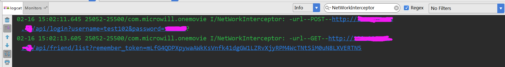

# OkHttpInterceptor

### OkHttp的请求拦截器，实现请求拦截，打印日志到logcat，链接已经拼接好
#### GET请求可以直接链接
#### POST请求需要使用Postman或者其它请求发送模拟器

### 日志截图

<a href="./art/clipboard.png"></a>

使用很简单
```
OkHttpClient okHttpClient = new OkHttpClient.Builder()
                .addInterceptor(new NetWorkInterceptor())
                .build();
```

